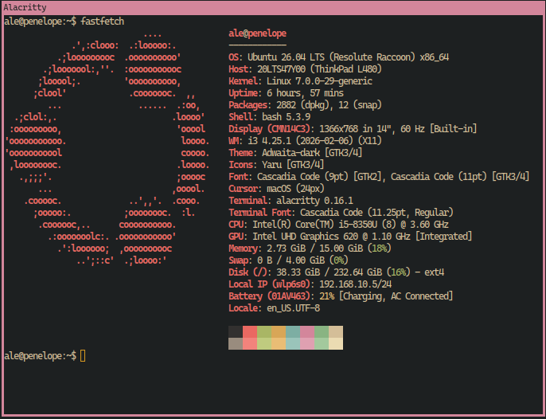
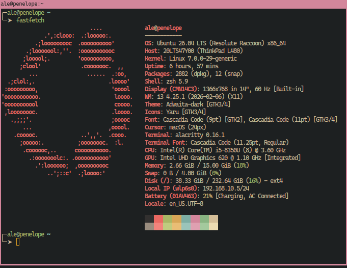
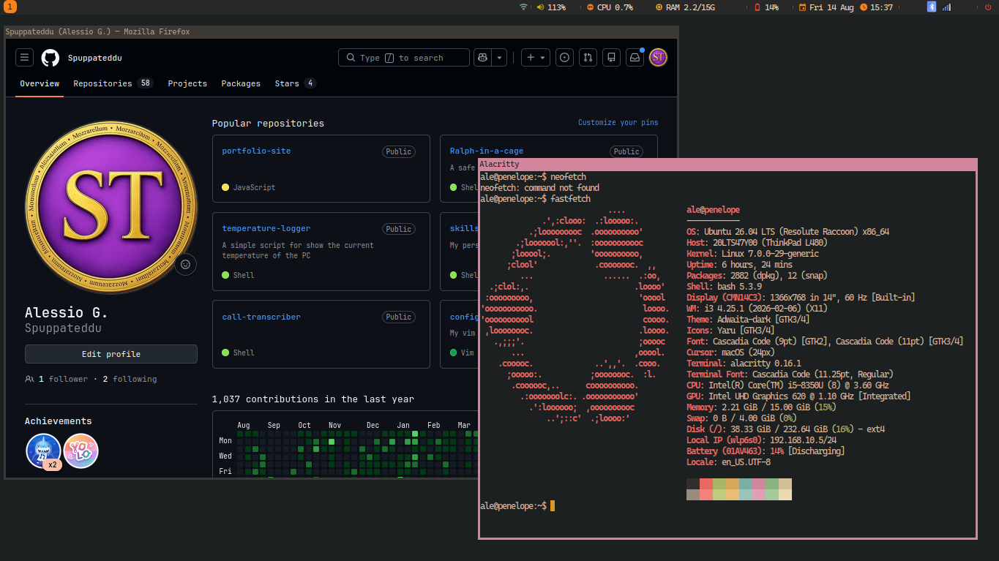

# best-linux-environment

Commands to replicate my personal Ubuntu setup on a fresh **Ubuntu 26.04 LTS**.


What a machine looks like after `./setup.sh`: i3 tiling the screen, Firefox with
no browser UI, `fastfetch` and the `temps` logger in Alacritty windows, all on
the same single font — Cascadia Code NF — and the same colours.

**Two files.** One you run, one the machine runs. There are no modes to pick and
no arguments to remember:

| | `./setup.sh` | `./boot.sh` |
| --- | --- | --- |
| Who starts it | you | the `@reboot` cron |
| Installs something new | ✅ | ❌ never |
| Asks you anything | ✅ once, up front — the shell, then checkbox lists | ❌ never |
| Pulls every repo, re-applies the configs | ✅ | ✅ |
| Moves versions forward (latest binaries) | ✅ | ✅ |
| **Rewrites config you edited** | ✅ — this is the reset | ❌ never |

`setup.sh` **decides**: it is the only thing that installs anything, the only
thing that asks a question, and running it again is the reset. `boot.sh`
**maintains**: it pulls, re-applies and refreshes, and it is incapable of making
a decision on your behalf — which is what makes it safe to run at every boot.

Both are **idempotent**: nothing already done is done twice, and a file that
already matches is not even rewritten.

## Quick start

```bash
git clone https://github.com/Spuppateddu/best-linux-environment.git ~/best-linux-environment
cd ~/best-linux-environment
./setup.sh
```

Preview without changing anything — both take `--dry-run`:

```bash
./setup.sh --dry-run
./boot.sh --dry-run
```

The repo is expected to live at `~/best-linux-environment`; every config repo it
manages is cloned side by side into **`~/linux-configuration/`** — one folder
holding all of them, so there is a single place to browse, edit and back up. The
hidden `$HOME` path each tool is known by (`~/.zsh` or `~/.bash`, `~/.vim`,
`~/.tmuxrc`, `~/.temps`, `~/.alacritty`, `~/.i3rc`, `~/.firefox`) stays behind as
a **symlink** to it.

That folder sits *beside* this repo rather than inside it, deliberately: inside,
it would have to be gitignored, and a gitignored directory inside a git repo is
what `git clean -xfd` deletes — taking every checkout and any uncommitted work
with it.

## How `setup.sh` asks

The design rule is **one question, every option visible**, rather than a stream
of yes/no prompts you have to sit through. A run goes:

1. **Mass install** — everything in the `necessary` tier, in a single `apt-get`
   call. Not asked about.
2. **Every question, together** — starting with the shell (zsh or bash), then two
   checkbox lists (your config repos, then the extra apps), plus vim's language
   support and Firefox's add-ons as two more, instead of a prompt each.
3. **Install** — from here nothing stops to ask. The answers are already in hand,
   including the ones the config repos' own installers would have wanted.
4. **Result** — what went in, what failed, what you ticked that still isn't there.

The shell comes first, because every list after it depends on the answer. It is
the one question here with exactly one answer, so it is the one list you cannot
untick your way out of — ↑/↓ move the dot, enter confirms it:

```
══ Which shell does this machine log in with? ══
   Both configs can sit on the machine; only this one gets 'chsh'.
   ↑/↓ pick one · enter confirm

 ❯ (•) zsh — Oh My Zsh, the gnzh prompt, ghost-text autosuggestions, live syntax highlighting   current login shell · config already installed
   ( ) bash — the same prompt and the same aliases, no framework, nothing third-party in your shell
```

Then the checkbox lists, driven the same way but ticking freely. Note that the
core list carries the shell you just picked and **not** the other one:

```
══ Core — your config repos ══
   ↑/↓ move · space toggle · a all · n none · enter confirm

 ❯ [x] bash — prompt, aliases, keybindings (no framework)      (~/.bash)
   [x] vim — plugins, LSP, per-language support                (~/.vim)
   [x] tmux — keybindings, status line, agent scripts          (~/.tmuxrc)
   [ ] temps — CPU/GPU temperature logger, aliased b-temp in your shell (~/.temps)
   [x] alacritty — colours, font, padding                      (~/.alacritty)
   [x] i3 — window manager, rofi, dunst, picom, eww            (~/.i3rc)
   [x] firefox — prefs, add-ons, Vimium, browser keybindings   (~/.firefox)
```

Without a terminal (a pipe, CI) the lists print and every default stands — there
is nobody to ask, and silently taking the defaults is the only honest answer. For
the shell question the default is **your current login shell**, so a run with
nobody watching never changes it.

## The three tiers

Everything this repo can install is one line in
[**`modules.conf`**](modules.conf), and that file's tier column is the only
thing that decides how you are asked about it. **To change your mind about
something, move its line** — there is no code to edit.

| Tier | Asked how | What belongs there |
| --- | --- | --- |
| **necessary** | never — always installed | the substrate (git, curl, a compiler) **and** everything the core repos name |
| **core** | checkbox list, **all pre-ticked** | your config repos, and only those |
| **secondary** | checkbox list, **none pre-ticked** | extra applications |

`necessary` is not "things I happen to want" — it is the set whose absence
**breaks** something else. The i3 config binds keys to alacritty, firefox and
flameshot; both shell configs call yazi and lazygit; alacritty and i3 both render Nerd
Font glyphs. Those aren't preferences, so they aren't questions.

See the current contents with:

```bash
./setup.sh --list          # all three tiers, ✓ marking what is already installed
```

Or install one thing by name, with no lists at all:

```bash
./setup.sh only steam docker
```

## Reset: re-running `setup.sh`

There is no separate `reset.sh` — a second `./setup.sh` **is** the reset. It
restores every configuration file this repo owns from the repo's own copy, so a
machine you've been poking at for months goes back to the setup described here.

What it does *not* touch: your data. Bookmarks and history, SSH keys, shell
history, anything not in the list below. Every file it does replace is copied
next to itself first as `<name>.backup.<pid>`, so a reset is undoable by hand.

Config files come in two kinds, and the reset is only interesting for the second:

- **Managed** — the repo owns the content outright, and nothing else writes it:
  the yazi `tmux-run` helper and plugin, the colour-emoji fontconfig rule, the
  LightDM greeter settings. Both scripts keep these matching the repo, so a fix
  here reaches every machine at the next boot. Each config repo applies the same
  rule to its own files — Firefox's `user.js` and `userChrome.css` are managed by
  `~/.firefox`, not by anything here.
- **Seeded** — written once so a tool starts out configured, then **yours**:
  `~/.config/yazi/keymap.toml` and `theme.toml`, `~/.config/opencode/tui.json`,
  the default cursor `~/.icons/default/index.theme`. `./boot.sh` never rewrites
  one of these once it exists, so your edits survive every boot; `./setup.sh`
  puts the repo's version back, because that run is the one you asked for.

Both live in one helper (`config_write`, in `lib/common.sh`), so a module just
declares which kind a file is and both scripts do the rest.

## Core: the config repos

The **core** tier is exactly this — eight configs, each in **its own repo**, all
cloned together into `~/linux-configuration/` (list in
[`tools.conf`](tools.conf), tier in [`modules.conf`](modules.conf)):

| Tool | Repo | Cloned to | Reachable at |
| --- | --- | --- | --- |
| zsh | [`configuration-zsh`](https://github.com/Spuppateddu/configuration-zsh) | `~/linux-configuration/zsh` | `~/.zsh` |
| bash | [`configuration-bash`](https://github.com/Spuppateddu/configuration-bash) | `~/linux-configuration/bash` | `~/.bash` |
| vim | [`configuration-vim`](https://github.com/Spuppateddu/configuration-vim) | `~/linux-configuration/vim` | `~/.vim` |
| tmux | [`configuration-tmux`](https://github.com/Spuppateddu/configuration-tmux) | `~/linux-configuration/tmux` | `~/.tmuxrc` |
| temps | [`temperature-logger`](https://github.com/Spuppateddu/temperature-logger) | `~/linux-configuration/temperature-logger` | `~/.temps` |
| alacritty | [`configuration-alacritty`](https://github.com/Spuppateddu/configuration-alacritty) | `~/linux-configuration/alacritty` | `~/.alacritty` |
| i3 | [`configuration-i3`](https://github.com/Spuppateddu/configuration-i3) | `~/linux-configuration/i3` | `~/.i3rc` |
| firefox | [`configuration-firefox`](https://github.com/Spuppateddu/configuration-firefox) | `~/linux-configuration/firefox` | `~/.firefox` |

`~/.firefox` is the *config repo*, not `~/.mozilla` — that one is Firefox's own
profile directory, which the repo writes into and must never be.

**zsh and bash are one slot, not two.** They are the two answers to the shell
question, so a normal machine has whichever one you picked. Both rows can end up
on disk — you changed your mind, or you want the other config there to read — and
that is fine: only the shell you picked owns your login shell, and
`basic/10-tools.sh` keeps it that way by passing `--no-login-shell` to the other
one's installer. Without that, both installers `chsh`, and every `./boot.sh`
would hand your login shell to whichever of them ran last. The answer lives in
`~/.cache/best-linux-environment/shell`; `./setup.sh` writes it, `./boot.sh`
reads it, and a machine that has never been asked reads as zsh, which is what
this repo installed before there was a choice.

Switching later is one command:

```bash
./setup.sh only bash-config    # or: only zsh-config
```

That wires the config, remembers the answer and `chsh`-es — naming a shell config
on the `only` path *is* the answer to the question there are no lists to ask it
in. Or just re-run `./setup.sh` and pick the other row.

The last column is a symlink to the third, and it is load-bearing rather than
cosmetic: the configs hardcode those paths. `~/.i3rc/config` names `~/.i3rc/`
some twenty times (picom, dunst, rofi, its own `scripts/`), `~/.zshrc` is a
single `source ~/.zsh/zshrc` (and `~/.bashrc` a single `source ~/.bash/bashrc`),
and vim reaches its vimrc through a runtimepath
containing `~/.vim` and nothing else. Keeping the old paths alive as symlinks is
what lets the repos move without a single config changing.

They are also why each tool's own `install.sh` is invoked *through* its `$HOME`
path: the installers resolve their location with `cd "$(dirname "$0")" && pwd`,
which is logical, so entering via `~/.vim` is what makes vim's own "am I at
`~/.vim`?" check pass.

### What the two shells look like

Same prompt, same aliases, same colours — the difference is what runs behind
them. zsh brings Oh My Zsh, autosuggestions and live syntax highlighting; bash
gets the same look with nothing third-party in the shell.

**bash** — `configuration-bash`, no framework:



**zsh** — `configuration-zsh`, Oh My Zsh and the gnzh prompt:



### The two i3 layouts

i3 runs here as a normal desktop, not as a tiling WM: **every window floats** by
default, with a title bar you can grab. `configuration-i3` keeps the other mode
one keybinding away — `$mod+Control+space` tiles the whole desktop, and back.

**Floating**, the default — windows overlap, the way a classic desktop behaves:



**Tiling** — every window takes a share of the screen and nothing overlaps:


### Converting an older machine

A machine set up before `~/linux-configuration/` existed still has the
checkouts sitting *at* the hidden `$HOME` paths instead of symlinked to them.
[`migration.sh`](migration.sh) moves them across and leaves the symlink behind;
it is also reachable as `~/linux-configuration/migration.sh`.

```bash
~/best-linux-environment/migration.sh --dry-run   # show the plan, touch nothing
~/best-linux-environment/migration.sh             # convert
```

Run it once per old machine — a second run reports "already converted" and
changes nothing. It moves only the tool repos; `best-linux-environment` stays at
`~/best-linux-environment` and the `@reboot` cron is left alone. Git stores no
absolute path in a clone, so remotes, history and uncommitted work all survive
the move. Close vim first if a plugin session is live.

A **fresh** machine needs none of this: `setup.sh` clones and symlinks the new
layout itself. `basic/10-tools.sh` also refuses to touch a tool still sitting at
its old `$HOME` path — it reports it and skips, rather than cloning a second
copy that the real `~/.vim` would silently shadow.

**This repo does not know how to install any of them.** Each config repo ships
its own idempotent `install.sh` (deps, wiring, plugin install, live reload);
`basic/10-tools.sh` only clones/updates each repo and calls that script. A repo
that ships no installer but does ship an executable — `temperature-logger` and
its `temps` — names it in the fifth column of `tools.conf` and gets symlinked
into `~/.local/bin` instead.

Those installers are always handed `/dev/null` for stdin, never your terminal.
Every question they would ask is one `setup.sh` has already asked: vim's
language support arrives as `--languages=php,javascript,…` from the checkbox
list, and Firefox's add-ons as `--extensions=ublock-origin,vimium-ff,…` from
another, rather than either stopping the run to ask. That is also what makes
`boot.sh` incapable of hanging on a prompt nobody is there to answer.

Both flags are omitted on the `boot.sh` path, because that run asks nothing —
and each installer then falls back to what this machine last chose (for Firefox,
`~/.cache/firefox-config/extensions`) rather than to its own defaults. An
unattended boot must never re-enable an add-on you deliberately unticked.

There is one deliberate exception, and it is the only installer that ever gets
the terminal. On a machine where `~/.firefox` has never been cloned, `setup.sh`
cannot build the add-on list at all — the catalogue it reads arrives with the
clone, three sections later — so it says so and hands that one question to the
repo's own `install.sh`, which draws the identical list right after its clone.
That path is taken only when `setup.sh` reports it hit that case *and* there is a
terminal; `boot.sh` never sets it, so it still cannot hang.

## Font sizes per machine: `fonts.local`

The config repos are shared by every PC, and every PC has a different screen. So
the one thing that is *not* shared is the sizes: they live in **`fonts.local`**,
a git-ignored file at the root of this repo, and nothing else on the machine
holds a size you are meant to edit.

```bash
cp fonts.local.example fonts.local
$EDITOR fonts.local
./setup.sh          # or ./boot.sh — and every boot re-applies it
```

Every line is commented out and shows the size its config repo ships. Uncomment
one to override that surface; delete it again and the repo's own size comes
back. Sizes are points, as the app spells them, bar the three marked px:

| Key | What it sizes |
| --- | --- |
| `BLE_SIZE_TERMINAL` | Alacritty — so bash, zsh, vim, tmux, lazygit, yazi |
| `BLE_SIZE_I3` | i3 window titles |
| `BLE_SIZE_BAR` | the eww bar across the top (px; icons follow at +4, +6) |
| `BLE_SIZE_ROFI` | the launcher (`$mod+d`) and the power menu |
| `BLE_SIZE_DUNST` | notifications |
| `BLE_SIZE_GTK` | GTK apps, their menus, and the LightDM login screen |
| `BLE_SIZE_FIREFOX_PAGE` | page text (px; code blocks follow at +1) |
| `BLE_SIZE_FIREFOX_UI` | Firefox's own bar — tabs, URL bar, menus (px) |

`basic/99-font-sizes.sh` applies them, last in a `setup.sh` run and after the
pull in a `boot.sh` one, then reloads i3, the bar and dunst if any of them moved.
Alacritty re-reads its own config; GTK apps and Firefox need a restart.

### It never edits the config repos

A size is written into a **separate override file** that the app reads *last* —
never into the repo file it belongs beside. That is the whole point: the clones
in `~/linux-configuration/` stay clean, so `git pull --ff-only` keeps working on
every boot. Each config repo carries the one line that loads its override, and
this repo warns rather than adds it if that line is missing:

| Surface | Override this repo writes | How the config repo loads it |
| --- | --- | --- |
| Alacritty | `~/.alacritty/size.local.toml` | last `import` in `alacritty.toml` |
| i3 | `~/.i3rc/05-fontsize.local` | the existing `include ~/.i3rc/*.local` |
| eww bar | `~/.i3rc/eww/size.local.scss` | `@import` at the foot of `eww.scss` |
| rofi | `~/.i3rc/rofi/size.local.rasi` | `@import` at the foot of both themes |
| dunst | `~/.i3rc/dunst/size.local.conf` | a second `-config` on dunst's line |
| GTK | `~/.config/gtk-{3,4}.0/size.local.css` | `@import` at the top of `gtk.css` |
| Firefox prefs | `~/.firefox/user.local.js` | appended to `user.js` by its installer |
| Firefox UI | `~/.firefox/chrome/userChrome.local.css` | `@import`, read as a CSS variable |

Two details that are not obvious. In Alacritty the **importing** file wins, so
the size cannot sit in `alacritty.toml` at all — the repo's own default moved to
`size.toml`, and yours imports after it. And GTK resolves a relative `@import`
beside the **symlink** it loaded, not beside the real file, which is why the GTK
override is written into `~/.config` rather than into the i3 repo.

The login screen and GTK2 have no repo of their own: `basic/50-fonts-cursor.sh`
reads `BLE_SIZE_GTK` straight from `lib/fonts.sh` and writes them itself.

## Auto-update at boot

`setup.sh` offers a `@reboot` cron the first time it runs. If you accept, every
boot runs `./boot.sh`, which:

1. `git pull`s **this repo** (and re-execs itself if it changed);
2. `git pull`s each **cloned** config repo and re-runs the `install.sh` it ships,
   so a config you pushed from another machine is applied here;
3. re-applies **`fonts.local`**, and reloads i3, the bar and dunst if a size
   moved;
4. **reloads what is running** — `i3-msg reload`, `tmux source-file` on every
   running server, `fc-cache`, `xrdb -merge`;
5. refreshes the binaries apt doesn't manage for us — **yazi**/`ya`, **fzf**,
   **lazygit** (only a `~/.local/bin` copy; an apt one belongs to apt) and
   **opencode** (`opencode upgrade`) — each behind a release-tag check, so a run
   with nothing new downloads nothing. Secondary apps are **not** in this list,
   so the `~/.local/bin` **lazydocker** binary is never bumped here:
   `bash advanced/lazydocker.sh --upgrade`;
6. logs to `~/.cache/best-linux-environment/boot.log`, trimmed to the last
   512 KiB at the start of each run so it can't grow without bound.

It **installs nothing new and asks nothing**. A repo you didn't tick is not
cloned; a config file you were meant to make yours is not rewritten. A boot can
move this machine forward — it can never reset it, and it can never decide
something for you. That is `setup.sh`'s job, always.

One honest limit on step 4: at boot there are no shells running yet, and nothing
can `source` a file into a shell that already exists anyway. A new `zshrc` or
`bashrc` applies to the next terminal you open. Steps 2, 3 and 4 are the parts that *can* be made to
take effect immediately, and they are — which is also why running `./boot.sh` by
hand is the quickest way to apply a config change you just pushed.

Cron runs have no terminal, so anything needing `sudo` (a new apt package) is
skipped with a warning — run `./setup.sh` from a terminal to pick those up.
If you skip the cron, run `./boot.sh` by hand, or re-run `./setup.sh` to be
offered it again.

## Desktop vs server

`setup.sh` detects up front whether the host is an **Ubuntu desktop** or a
**server**. Every `modules.conf` line whose scope is `gui` is then dropped as the
manifest loads, so on a server those entries are never listed, never installed
and never reported missing — i3 and alacritty, the Nerd Font + cursor, LightDM,
Flameshot, Firefox, ARandR, and every graphical secondary app. CLI entries (your
shell, vim, tmux, temps, lazygit, yazi, ssh, opencode, docker, lazydocker) still
appear and still install — the shell question is asked on a server too.

Detection order: `BLE_PROFILE` env override → the **install-type metapackage**
(`ubuntu-desktop`/`ubuntu-desktop-minimal` vs `ubuntu-server`) → a live
`DISPLAY`/Wayland session → systemd default target (`graphical.target` vs
`multi-user.target`) → leftover desktop/X packages.

The metapackage comes first because it is the one signal this repo can't
pollute: the moment it installs lightdm + i3, a server starts looking like a
desktop by every other test. Force it either way:

```bash
BLE_PROFILE=server  ./setup.sh   # treat as headless — no GUI
BLE_PROFILE=desktop ./setup.sh   # force the full graphical set
```

GUI modules also self-skip via `require_desktop` in `lib/common.sh`, and config
repos are tagged desktop-only with a `gui` scope in
[`tools.conf`](tools.conf) as well as in `modules.conf`.

## What the `necessary` tier installs

The modules under `basic/`, named by `modules.conf`. Order matters and the
manifest's order is the install order — the substrate exists before the config
repos install into it, and fonts before the tools that render them. Items marked
**(desktop)** are dropped on a server.

1. **the apt substrate** — `git curl wget unzip xz-utils ca-certificates gnupg
   build-essential pkg-config zsh cron software-properties-common
   openssh-client`, all in one `apt-get` call, before anything else runs.
2. **`10-tools`** — invoked once per config repo `setup.sh` decided on: clone or
   pull it, symlink it to its hidden `$HOME` folder, and run **its own**
   `install.sh`. `alacritty` and `i3` are desktop-only. Config-only repos
   (alacritty ships just a `.toml`, no installer) are cloned here; their package
   + linking is owned by a module below.
3. **`20-ssh`** — the SSH **client** half: `openssh-client`, for connecting
   *out*. It opens no port and listens for nothing, which is why it is
   `necessary` and never asked about — the server half is a separate
   `secondary` entry (see below). It also generates a default passphrase-less
   `~/.ssh/id_ed25519` if none exists; an existing key is never touched. Add a
   passphrase later with `ssh-keygen -p -f ~/.ssh/id_ed25519`.
   **Password logins are left on**, as Ubuntu ships them. An earlier version
   turned them off (`PasswordAuthentication no` in
   `/etc/ssh/sshd_config.d/60-best-linux-environment.conf`) once
   `~/.ssh/authorized_keys` was non-empty; across several machines that locks
   the fleet out of itself, because the key minted above is for connecting
   **out** and authorizes nothing **in** — so a host is reachable only from
   whichever machine ran `ssh-copy-id` first, and getting back in costs a trip
   to its keyboard. The module now **removes** that file if it finds one and
   reloads `ssh`, so re-running fixes a machine that still has it.
4. **`30-lightdm`** *(desktop)* — [LightDM](https://github.com/canonical/lightdm)
   + GTK greeter, made the **default** display manager (replacing GDM3). GDM3's
   session picker is a hard-to-find cog that on some builds never surfaces the
   i3 xsession; the LightDM greeter shows a session dropdown on the login form,
   so choosing **i3** is one click. Switch is preseeded via debconf (no
   interactive `dpkg-reconfigure`) and applies at the next reboot.
5. **`40-lazygit`** — [lazygit](https://github.com/jesseduffield/lazygit) git
   TUI. Prefers apt (26.04 ships a recent build); falls back to the latest
   prebuilt binary from GitHub (→ `~/.local/bin`) on releases without a package.
   `./boot.sh` bumps that fallback copy to the newest release — an apt-managed
   one is left to apt, since shadowing it with a download would quietly take it
   out of the system's hands. Installed **because git is**: the module skips
   itself when `git` isn't there (see
   [git → lazygit](#paired-tools-git--lazygit-docker--lazydocker)).
6. **`50-fonts-cursor`** *(desktop)* — cross-cutting **fonts + macOS cursor**,
   owned here so the per-tool repos stay light. **One family for the whole
   machine: Cascadia Code NF.** Microsoft's programming face — a 0.586 em
   advance, a tall 0.518 em x-height, and four real faces (Regular, Bold,
   Italic, Bold Italic), so bold-as-emphasis stays bold — in upstream's **NF**
   build, which is the same face with the Nerd Fonts icon range patched in. That
   one detail is what lets the desktop stop at a single font: the i3 bar's
   battery, wifi and volume glyphs come out of the same file as the text around
   them, with nothing sitting behind it. Fetched from **upstream's own release**
   (pinned at `2407.24`), and from it the four **static** TTFs, not the variable
   build — only the statics report `style=Bold`/`Italic`, which is how
   `alacritty.toml` names them. The install is *exclusive*: it **deletes every
   other font this user had installed** (`~/.local/share/fonts`, `~/.fonts` —
   never `/usr/share/fonts`, which stays as the CJK/emoji/symbol fallback), then
   points fontconfig, gsettings and GTK2 at Cascadia, so `serif`, `sans-serif`,
   `monospace` and any concrete family a program names all resolve to it. Glyphs
   it doesn't have still fall through to the font that does. GTK3/4 come from
   `~/.i3rc`'s own `settings.ini`. The family is fixed; the **sizes** are not —
   the greeter and GTK2 take theirs from `BLE_SIZE_GTK`, see
   [`fonts.local`](#font-sizes-per-machine-fontslocal).
7. **`52-alacritty`** *(desktop)* — the **Alacritty** terminal, apt package only.
   The config repo (`~/.alacritty`) ships its own `install.sh`, run by
   `10-tools`, and that is what links `alacritty.toml` into
   `~/.config/alacritty/` — where Alacritty actually reads it — and the symbol
   fallback rule into `~/.config/fontconfig/conf.d/`. This module keeps the
   package so the terminal exists even when that tool was skipped in the menu.
8. **`55-yazi`** — [Yazi](https://github.com/sxyazi/yazi) TUI file manager
   (prebuilt binary → `~/.local/bin`) with in-terminal image/video/PDF preview.
   Alacritty has no graphics protocol, so preview goes through **ueberzugpp**
   (installed as a `.deb` from its OBS repo) plus `ffmpegthumbnailer`/`poppler`.
   yazi auto-detects ueberzugpp, so *preview* needs no configuring — but the
   module does write `~/.config/yazi/yazi.toml` for the git-status fetchers
   (migrating a pre-26.1.22 fetcher block in place, keeping a `.bak`), along
   with `theme.toml`, `keymap.toml` and `init.lua` — `theme.toml` and
   `keymap.toml` are **seeded**, so they are yours after the first write and
   only `./setup.sh` resets them. `./boot.sh` moves the yazi and fzf
   binaries, and `ya pkg upgrade`s the flavor and plugins. Runs after the Nerd
   Font so its icons render. Ships the **gruvbox-dark** flavor (`ya pkg add
   bennyyip/gruvbox-dark`) wired in `~/.config/yazi/theme.toml`. Also installs
   **zoxide** (apt) and the latest **fzf** binary (→ `~/.local/bin`) for the
   `z`/`Z` bindings — apt's fzf 0.44 renders the picker blank under yazi.
   The two `ya pkg add` calls need the network, so on an offline run (the boot
   cron fires 45s in) they warn and the module carries on — and it then skips
   the config that would *name* the missing package, since yazi rejects its
   whole config over one bad reference. The next run with a network finishes it.
9. **`60-flameshot`** *(desktop)* — screenshot tool (i3's `$mod+Shift+s`); apt package.
10. **`70-firefox`** *(desktop)* — [Firefox](https://www.mozilla.org/firefox/) from
   **Mozilla's own apt repo**, pinned above the Ubuntu archive — explicitly *not*
   the snap that `apt install firefox` would pull. The snap's `desktop-launch`
   wrapper overwrites `XCURSOR_PATH` with two read-only snap-internal dirs,
   dropping `~/.icons` (and so the macOS cursor from `50-fonts-cursor`) out of
   libXcursor's search path — the pointer visibly changes shape over every
   Firefox window, and no setting on your side can fix it. The pin names the
   Firefox packages only, not `Package: *`, so it can't drag an installed
   Thunderbird over to Mozilla's build as a side effect. The module also
   migrates an existing snap profile to `~/.mozilla` and then removes the snap —
   but **only** once `~/.mozilla` really holds a profile (`profiles.ini` naming
   a directory that exists), not merely because `~/.mozilla/firefox` is there.
   An empty leftover of that directory is common, and `snap remove` deletes
   `~/snap/firefox` with the snap, so guessing here costs you the profile.
   Scope is the **package**, not the configuration: prefs, add-ons, Vimium and
   the browser key bindings are their own repo (`~/.firefox`, the
   `firefox-config` core entry) — see [Firefox config](#firefox-config) below.
11. **`80-arandr`** *(desktop)* — GUI for xrandr (monitor layout); apt package.
12. **`90-opencode`** *(secondary)* — [opencode](https://opencode.ai) terminal
   AI coding agent via its official user-local script (installs to
   `~/.local/bin/opencode`). That script is fetched from `opencode.ai` and piped
   into `bash`, which is why opencode sits in **`secondary`**: reaching this
   module at all means you ticked it. It seeds the built-in **gruvbox** theme in
   `~/.config/opencode/tui.json` — opencode writes that file itself when you
   change the theme in the TUI, so `./boot.sh` leaves it alone and runs
   `opencode upgrade` instead.

### Where the questions went

Earlier versions of this repo asked in four different places: `20-ssh` prompted
about opening a port, `90-opencode` about piping a remote script into bash,
`10-tools` showed a numbered tool menu, and the runner showed another for the
advanced apps — each at a different moment in a long run, each wanting a
different kind of answer.

None of them ask any more. A module that is running has already been chosen, and
the choosing happens once, up front, in `setup.sh`'s checkbox lists:

| Old prompt | Now |
| --- | --- |
| `20-ssh`: "install OpenSSH?" | split in two — the client is `necessary` (opens no port), `openssh-server` is a `secondary` box |
| `90-opencode`: "pipe this script into bash?" | a `secondary` box — the list *is* the question |
| `10-tools`: numbered tool menu | the `core` list, pre-ticked |
| advanced-apps menu | the `secondary` list |
| vim: php? javascript? python? c? | one list, passed down as `--languages=…` |
| Firefox add-ons: whatever `extensions.conf` happened to say | one list, passed down as `--extensions=…` |

There is no remembered-decline file any more, and nothing to delete to be asked
again — every list shows the whole picture on every run, with what you already
have marked `✓ installed`. What you ticked before is recorded in
`~/.cache/best-linux-environment/chosen`, and only so the `secondary` list opens
pre-ticked on the next run instead of blank.

### Firefox config

The browser is installed here; **how it is configured is its own repo** —
[`configuration-firefox`](https://github.com/Spuppateddu/configuration-firefox), cloned to
`~/linux-configuration/firefox` and reachable as `~/.firefox`, exactly like zsh,
vim, tmux, alacritty and i3. It used to live in `basic/firefox-config/` with two
modules driving it (`71-firefox-sync`, `72-firefox-keys`); it grew past the size
where that made sense, so it moved out whole and those two modules went with it.

The split is the same one alacritty has: **the package is this repo's business,
the configuration is the tool's.** `70-firefox` owns the apt repo, the pin, the
deb, the snap→deb profile migration and retiring the snap — the parts that are
about Ubuntu rather than about Firefox. Everything else is `~/.firefox`:

| File | What it carries |
| --- | --- |
| `user.js` | curated prefs — toolbar layout, Gruvbox theme, blank new tab, no autofill/password manager, no speculative prefetch |
| `chrome/userChrome.css` | hides the whole browser UI; **Ctrl+Shift+B** toggles it back |
| `extensions.conf` | the add-on catalogue, as `id\|amo-slug\|label\|default` |
| `vimium-settings.json` | Vimium's key mappings and its Gruvbox hint/vomnibar CSS |
| `autoconfig/` | `firefox.cfg` + `autoconfig.js` — the browser-level key bindings, installed into `/usr/lib/firefox` |

That repo's `README.md` documents all of it: the chromeless UI and its
`Ctrl+Shift+B` toggle, the Super+h/j/k/l tab keys and the one-second header peek
they trigger, why the bindings are at the browser level rather than in Vimium,
and exactly which parts of your profile are never touched (bookmarks, history,
cookies, logins, sessions, containers, search engines — all of it).

**Which add-ons get installed is a question**, asked with all the others:

```
══ Firefox — which add-ons to install ══
   Installed by Firefox's own policy and kept updated from AMO. Unticking one
   never uninstalls it — do that in about:addons.
 ❯ [x] uBlock Origin — content blocker
   [x] Vimium — vim keys for the web
   [x] Gruvbox — the browser theme user.js selects
   [ ] Bitwarden — password manager (needs your account)
   [ ] Wappalyzer — what a site is built with
```

The rows come from `~/.firefox/extensions.conf`, and the answer goes down as
`--extensions=…` — so add-ons are declared by Firefox's enterprise policy
(`/etc/firefox/policies/policies.json`, `installation_mode: normal_installed`)
rather than by copying `.xpi` files around. Your choice is remembered in
`~/.cache/firefox-config/extensions` so `boot.sh` re-applies it instead of
resetting to the repo's defaults.

On a machine that has never cloned the repo the list can't be built *here* yet —
there is no `extensions.conf` on disk until section 3 clones it — so this run
says so and asks nothing. You still get the question: with no `--extensions=` to
go on, the repo's own `install.sh` draws the same list itself a moment later,
once section 3 has cloned it. Every run after that asks up here instead, and the
installer stays quiet.

### Design: light repos, one orchestrator

Each tool keeps its own repo (under `~/linux-configuration/`, reachable as
`~/.zsh` or `~/.bash`, `~/.vim`, `~/.tmuxrc`, `~/.alacritty`, `~/.i3rc`) and **its own
install logic** — an idempotent `install.sh` at the
repo root that installs deps, wires configs, and reloads live where possible.
This repo only clones/updates them (per `tools.conf`) and calls that script;
it never reimplements a tool's install. Anything cross-cutting that would
otherwise bloat a single repo — the cursor theme, the shared Nerd Font — lives
**here** instead (`configuration-i3`'s `setup.sh` no longer carries its own copies).

## What the `secondary` tier installs

Extra apps, each a standalone script in `advanced/`, listed in one checkbox list
with **nothing pre-ticked**. Leaving every box unticked still gives you a
complete environment — nothing else in the repo depends on any of these.

Anything already installed shows as `✓ installed` and pre-ticked rather than
being hidden, so the list is an honest picture of the machine. Re-installing is a
no-op; unticking never uninstalls.

Most are graphical and so tagged `gui` in `modules.conf`, which drops them from
the list entirely on a server. `docker`, `lazydocker`, `opencode` and `sshd` are
the exceptions — CLI, scope `all` — so they still appear on a headless box, and
can be installed there directly:

```bash
./setup.sh only docker      # server-friendly, and pulls in lazydocker too
```

### Paired tools: git → lazygit, docker → lazydocker

A TUI is worth having exactly when the thing it drives is there, so both pairs
are wired rather than asked about:

- **git → lazygit** — `basic/40-lazygit.sh` installs the git TUI on every
  machine, and skips itself when `git` is absent (only reachable when `00-base`
  couldn't run — no `sudo` under the boot cron, say).
- **docker → lazydocker** — `advanced/docker.sh` chains into
  `advanced/lazydocker.sh` once the daemon is in, so picking `docker` gets you
  both. One direction only: `lazydocker.sh` *says* when Docker is missing but
  never installs it, so a TUI install can't quietly set up a system daemon.
  Picking `lazydocker` alone is fine and gets just the TUI.

**To add one:** drop an `advanced/<name>.sh` file, then add **one line** to
[`modules.conf`](modules.conf). The script should:

- source `lib/common.sh`;
- define `is_installed()` (its detection, e.g. `apt_installed <pkg>`);
- answer `--check` up top — `[[ "${1:-}" == "--check" ]] && { is_installed && exit 0 || exit 1; }`
  (this is what the manifest's `check` column calls to mark it `✓ installed`);
- early-exit when `is_installed` so re-runs are no-ops (`docker` is the one
  documented exception — see below).

For an app that is just one package from the Ubuntu repos, that last point is a
single line — `apt_app_module <pkg> "<Label>" --desktop` does the title, the
server skip, the already-installed check and the final `ok`. See
[`advanced/okular.sh`](advanced/okular.sh).

The manifest line is what puts it in the list:

```
secondary|okular|gui|script|run:advanced/okular.sh|Okular — PDF reader
```

| App | Source |
| --- | --- |
| `brave` | [Brave apt repo](https://brave.com/linux/) |
| `xournalpp` | Ubuntu repos |
| `okular` | Ubuntu repos |
| `steam` | multiverse (`steam-installer`) + i386 |
| `tableplus` | [TablePlus apt repo](https://tableplus.com/linux) |
| `megasync` | [MEGA apt repo](https://mega.io/desktop) (`xUbuntu_<release>`) |
| `opencode` | [opencode.ai](https://opencode.ai) install script → `~/.local/bin` — CLI, no desktop needed |
| `sshd` | Ubuntu repos (`openssh-server`) — opens port 22 for logins *into* this host |
| `docker` | [Docker's apt repo](https://docs.docker.com/engine/install/ubuntu/) — CLI, no desktop needed |
| `lazydocker` | [GitHub release binary](https://github.com/jesseduffield/lazydocker) → `~/.local/bin` — CLI, no desktop needed |

**`sshd`** is the server half of SSH, split out of `basic/20-ssh.sh`. Every
other thing this repo installs affects only this machine; `openssh-server` opens
a port to the network, on a laptop as readily as on a server, so it is a box you
tick rather than a side effect of setting up your environment. **Password logins
are left on**, as Ubuntu ships them. An earlier version turned them off
(`PasswordAuthentication no` in
`/etc/ssh/sshd_config.d/60-best-linux-environment.conf`) once
`~/.ssh/authorized_keys` was non-empty; across several machines that locks the
fleet out of itself, because the key `20-ssh` mints is for connecting **out** and
authorizes nothing **in** — so a host is reachable only from whichever machine
ran `ssh-copy-id` first, and getting back in costs a trip to its keyboard.
`basic/20-ssh.sh` now **removes** that file if it finds one and reloads `ssh`, so
re-running `./setup.sh` fixes a machine that still has it.

**`docker`** installs Docker **CE** on a machine with no Docker at all —
`docker-ce`, `docker-ce-cli`, `containerd.io` and the `buildx` + `compose`
plugins — from Docker's own repo, keyed per Ubuntu codename. Then it enables
`docker.service` and adds you to the `docker` group (which starts working at your
**next login**, or `newgrp docker` now). Note that group is root-equivalent by
design — anyone in it can bind-mount `/` into a container.

A machine that already runs Ubuntu's **`docker.io`** stays on it. That package
used to trail upstream badly and ship no `docker compose`; current Ubuntu carries
Docker 29.x and packages the subcommands separately, so the module just ensures
`docker-compose-v2` + `docker-buildx` are installed and moves on. Swapping a live
daemon for CE would stop every running container, which is your call to make, not
a setup script's.

It is the one advanced module that doesn't early-exit when already installed: the
service and group checks are the parts that actually break, both are idempotent,
and `./setup.sh` runs the module regardless. If `docker-compose` (v1),
`docker-doc` or `podman-docker` is installed it stops and tells you what to remove
rather than removing a running daemon for you — they own `/usr/bin/docker` and
would make the CE unpack fail. If Docker hasn't published your codename yet, it
says so and points at `docker.io` + `docker-compose-v2` as the stopgap.

**`lazydocker`** has no apt repo anywhere, so it's the prebuilt release tarball
into `~/.local/bin` — the same path `40-lazygit` falls back to. Because
`./boot.sh` refreshes only lazygit, yazi and opencode, **no cron will bump it**; ask for
the upgrade explicitly:

```bash
bash advanced/lazydocker.sh --upgrade    # no-op when already on the newest release
```

## Shared library

Five files, all sourced — never run. `lib/common.sh` holds what a **module**
needs, `lib/fonts.sh` what the two modules that render text need; the other three
hold what an **entry script** needs, which is what lets `setup.sh` and `boot.sh`
be thin wrappers over the same modules instead of two copies of the same loop.

| `lib/common.sh` | What it does |
| --- | --- |
| `step` / `ok` / `skip` / `warn` / `fail` / `title` | colored output |
| `run` | execute, or just print under `--dry-run` |
| `has_cmd`, `can_sudo`, `require_apt` | environment probes |
| `is_desktop` / `is_server` / `require_desktop` / `profile_label` | desktop-vs-server profile |
| `config_write` | write a config file — `--seed` for one that becomes yours, plain for one the repo owns; skips an identical file, backs up what it replaces |
| `force_config` / `want_upgrade` | what this mode is allowed to do (set from `BLE_MODE`) |
| `BLE_SHELL` / `remember_shell` / `other_shell` | which shell owns the login shell — read back from `~/.cache/best-linux-environment/shell`, zsh when never asked |
| `apt_ensure`, `apt_refresh`, `apt_installed`, `apt_has_candidate`, `apt_repo_add` | apt |
| `apt_app_module` | the whole body of a one-package module (`apt_app_module arandr "ARandR" --desktop`) |
| `arch_pick`, `gh_latest_tag`, `gh_newer_tag`, `have_local_bin`, `install_tarball_bin` | resolving, installing and upgrading prebuilt GitHub release downloads |
| `clone_or_pull`, `link`, `xsessionrc_export` | git checkouts, symlinks, session-wide env vars |

| `lib/fonts.sh` | What it does |
| --- | --- |
| `fonts_load` | parse `fonts.local` into `BLE_SIZE_*` — read as data, never sourced, so a typo costs one warned line and not the run |
| `BLE_SIZE_*` | this machine's sizes, empty where the file sets none |
| `BLE_FONT_FAMILY_TEXT` | the one text family of the whole desktop |
| `fonts_int` | a size plus an offset, rounded — for the px surfaces |

| `lib/registry.sh` | What it does |
| --- | --- |
| `registry_load` | parse `modules.conf`, dropping `gui` entries on a server |
| `mod_indices` / `mod_index_of` | find entries by tier or by id |
| `mod_installed` | evaluate an entry's `check` column (`cmd:` / `apt:` / `link:` / `script`) |
| `mod_apt_packages` | the packages an entry names, for batching the mass install |
| `mod_run` | carry out an entry's actions (`apt:` / `run:` / `tool:`) in order |

| `lib/ui.sh` | What it does |
| --- | --- |
| `chk_reset` / `chk_add` | build a list |
| `checklist` | draw it and drive it, **any number ticked** — arrows, space, `a`, `n`, enter; takes the defaults with no terminal |
| `radiolist` | the same list, **exactly one ticked** — arrows move the dot, enter confirms. Only the shell question uses it |
| `chk_picked` / `chk_count` | read the answers back (after `radiolist`, `chk_picked` prints exactly one index) |

| `lib/runner.sh` | What it does |
| --- | --- |
| `self_update` | `git pull` this repo and re-exec the new entry script |
| `install_cron` / `cron_installed` / `cron_stale` / `trim_boot_log` | the `@reboot` cron and its log |
| `finish` | the closing summary + exit code both scripts end on |

**`BLE_MODE`** is the one switch, and it has two values, one per entry script:
`setup` (rewrite config the repo owns — the reset — and move versions forward)
and `boot` (move versions forward, rewrite nothing you own). Modules never test
it directly: they call `config_write` (which reads it) or ask `want_upgrade`.
Adding a config file to a module is one call and it behaves correctly in both for
free.

There is no second switch and no "don't ask" flag, because nothing below the
entry script asks anything. `basic/10-tools.sh` hands every config repo's own
installer `/dev/null` for stdin unconditionally, and passes vim's answer down as
`--languages=…` — so a question can't appear halfway through a run, and
`boot.sh` can't hang on one.

`apt_ensure` self-heals a freshly-added third-party repo: if a package has no
install candidate it refreshes the apt index once and re-scans before giving up,
so apps like Brave and TablePlus install on the first run instead of being
skipped against a stale index.

## Notes

- **Nothing is reinstalled.** apt packages are checked with `dpkg` first; each
  app/module self-skips when already present.
- **Nothing is rewritten for the sake of it.** A config file whose content
  already matches is left byte-identical — no write, no backup, no mtime change
  — which is what keeps the boot cron from dropping a copy of everything into
  `$HOME` at every boot.
- **Config repos are pulled, then reloaded.** On every `./boot.sh` — so at every
  boot — each cloned `~/.zsh`, `~/.bash`, `~/.vim`, `~/.tmuxrc`, `~/.temps`,
  `~/.alacritty`, `~/.i3rc` is `git pull`ed and its own `install.sh` re-applied,
  live where possible: tmux via `source-file`, i3 via `i3-msg reload`, alacritty
  auto-reloads, and `boot.sh` re-runs those two itself for the repos whose
  installer didn't need to. A shell can't reload itself once it exists, so a new
  `zshrc`/`bashrc` applies to the next terminal you open; vim loads on next
  launch. This is also the step that keeps the two shell configs from fighting:
  the one that doesn't own your login shell is re-applied with
  `--no-login-shell`, so no boot ever changes which shell you log in with.
- Third-party repos resolve the Ubuntu release at runtime (`lsb_release`), so
  nothing is hardcoded to a codename. If MEGA hasn't published an `xUbuntu_26.04`
  build yet, that module warns and points to the manual `.deb`.
- **A failing module doesn't stop the run.** Every module and app
  is allowed to fail on its own — a download that 404s, a repo that's briefly
  offline — and the rest still install. The names of whatever failed are listed
  at the end and the run exits non-zero, so `./setup.sh && …` still tells the
  truth; re-run to retry just those.
- Everything is safe to re-run.
